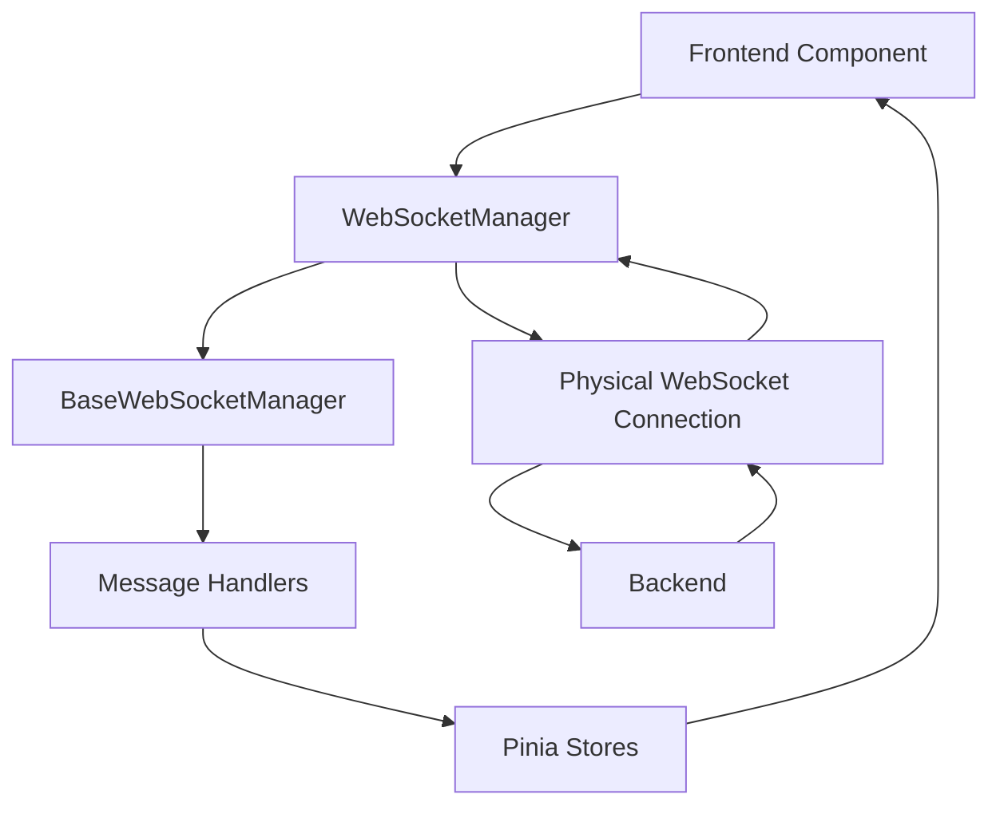

# Arquitectura WebSocket - Diseño SOLID

## 🔍 **Análisis de Responsabilidades**

### **BaseWebSocketManager** (Clase Abstracta)
- ✅ **Principio de Responsabilidad Única**: Maneja la lógica común de mensajes WebSocket
- ✅ **Funciones específicas**:
  - Gestión de suscripciones a mensajes (`subscribe`)
  - Despacho de mensajes a handlers (`dispatchMessage`)
  - Manejo automático de heartbeat
  - Estado de conexión genérico
  - Limpieza de recursos

### **WebSocketManager** (Implementación Concreta)
- ✅ **Principio de Responsabilidad Única**: Maneja la conexión WebSocket real
- ✅ **Funciones específicas**:
  - Establecimiento de conexión WebSocket
  - Reconexión automática
  - Envío de mensajes (solo heartbeat)
  - Manejo de eventos de conexión/desconexión
  - Integración con stores de Vue

## 🎯 **¿Por qué esta Separación es SOLID?**

### **1. Single Responsibility Principle (SRP)**
```typescript
// BaseWebSocketManager: Solo maneja lógica de mensajes
abstract class BaseWebSocketManager {
  // Responsabilidad: Gestión de mensajes y handlers
  subscribe<K extends WebSocketMessageType>() { ... }
  protected dispatchMessage() { ... }
  private handleHeartbeat() { ... }
}

// WebSocketManager: Solo maneja conexión física
class WebSocketManager extends BaseWebSocketManager {
  // Responsabilidad: Conexión WebSocket real
  connect(): Promise<void> { ... }
  disconnect(): void { ... }
  private attemptReconnect() { ... }
}
```

### **2. Open/Closed Principle (OCP)**
```typescript
// Puedes crear diferentes implementaciones sin modificar la base
class MockWebSocketManager extends BaseWebSocketManager {
  // Para testing
  protected sendHeartbeatResponse(): void {
    console.log('Mock heartbeat sent')
  }
}

class SSEWebSocketManager extends BaseWebSocketManager {
  // Para Server-Sent Events como alternativa
  protected sendHeartbeatResponse(): void {
    // Implementación SSE
  }
}
```

### **3. Liskov Substitution Principle (LSP)**
```typescript
// Cualquier implementación puede reemplazar a la base
function useWebSocketConnection(manager: BaseWebSocketManager) {
  manager.subscribe('game_status', (data) => {
    // Funciona con cualquier implementación
  })
}
```

### **4. Interface Segregation Principle (ISP)**
```typescript
// BaseWebSocketManager no fuerza métodos que no necesitas
// Solo define lo esencial para mensajería
abstract class BaseWebSocketManager {
  // Solo métodos relacionados con mensajes
  abstract sendHeartbeatResponse(): void
  // No incluye métodos específicos de conexión
}
```

### **5. Dependency Inversion Principle (DIP)**
```typescript
// Los stores dependen de la abstracción, no de la implementación
export function useWebSocketStore() {
  let manager: BaseWebSocketManager // Abstracción
  
  const subscribeToMessage = <K extends WebSocketMessageType>(
    type: K, 
    handler: MessageHandler<WebSocketMessageMap[K]>
  ) => {
    return manager.subscribe(type, handler) // Usa la abstracción
  }
}
```

## 🚀 **Beneficios del Diseño Actual**

### **Extensibilidad**
```typescript
// Fácil agregar nuevas implementaciones
class ReliableWebSocketManager extends BaseWebSocketManager {
  // Con garantía de entrega de mensajes
  private messageQueue: GameWebSocketMessage[] = []
  
  protected sendHeartbeatResponse(): void {
    // Implementación con cola de mensajes
  }
}
```

### **Testabilidad**
```typescript
// Fácil crear mocks para testing
class TestWebSocketManager extends BaseWebSocketManager {
  simulateMessage(type: WebSocketMessageType, data: any) {
    this.dispatchMessage({ type, data })
  }
  
  protected sendHeartbeatResponse(): void {
    // Mock implementation
  }
}
```

### **Separación de Concerns**
```typescript
// BaseWebSocketManager: "¿QUÉ hacer con los mensajes?"
// WebSocketManager: "¿CÓMO conectarse al servidor?"

// Ejemplo de uso limpio:
const manager = new WebSocketManager(url, token)
await manager.connect() // WebSocketManager se encarga de CÓMO

manager.subscribe('game_status', (data) => {
  // BaseWebSocketManager se encarga de QUÉ
  gameStore.updateGameStatus(data)
})
```

## 📋 **Flujo de Responsabilidades**

### **Durante la Conexión:**
1. **WebSocketManager**: Establece conexión física
2. **WebSocketManager**: Maneja eventos de conexión
3. **BaseWebSocketManager**: Actualiza estado de conexión

### **Durante Mensajería:**
1. **WebSocketManager**: Recibe mensaje crudo del WebSocket
2. **BaseWebSocketManager**: Parsea y valida el mensaje
3. **BaseWebSocketManager**: Despacha a handlers registrados
4. **WebSocketManager**: Envía heartbeat si es necesario

### **Durante Desconexión:**
1. **WebSocketManager**: Detecta desconexión
2. **WebSocketManager**: Intenta reconexión
3. **BaseWebSocketManager**: Limpia handlers y estado

## ✅ **Conclusión**

El diseño **SÍ sigue los principios SOLID** correctamente:

- **Separación clara de responsabilidades**
- **Extensibilidad sin modificar código existente**
- **Facilidad para testing**
- **Reutilización de lógica común**
- **Flexibilidad para diferentes implementaciones**

La confusión es natural porque ambas clases trabajan con WebSockets, pero cada una tiene un **nivel de abstracción diferente**:

- **BaseWebSocketManager**: Nivel de **aplicación** (mensajes, handlers)
- **WebSocketManager**: Nivel de **infraestructura** (conexión, red)

Este patrón es muy común en arquitecturas bien diseñadas y permite mantener el código escalable y mantenible.

## 🔄 **Flujo de Datos Completo**



### **Responsabilidades por Capa:**

1. **Frontend Component**: UI y interacción del usuario
2. **WebSocketManager**: Gestión de conexión física
3. **BaseWebSocketManager**: Procesamiento de mensajes
4. **Message Handlers**: Lógica específica por tipo de mensaje
5. **Pinia Stores**: Estado reactivo de la aplicación

Este diseño asegura que cada clase tenga una responsabilidad clara y bien definida, facilitando el mantenimiento y la extensión del código.